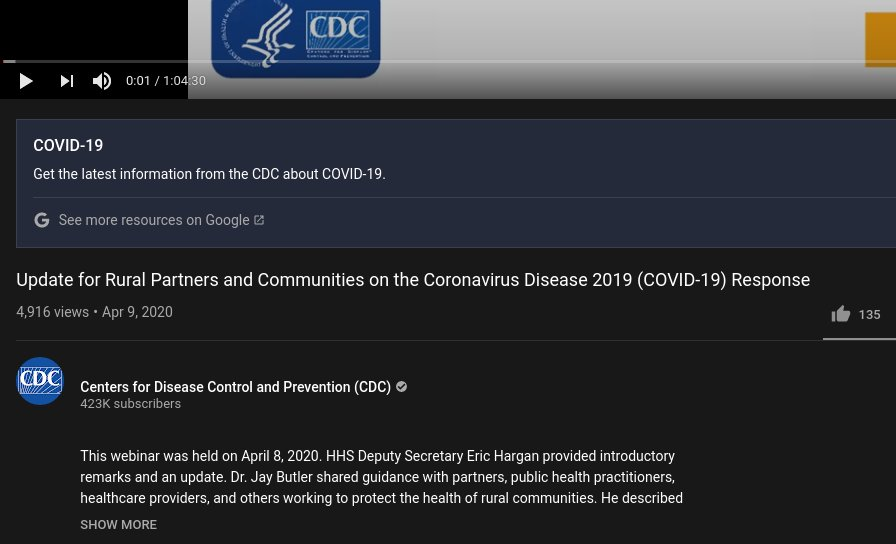
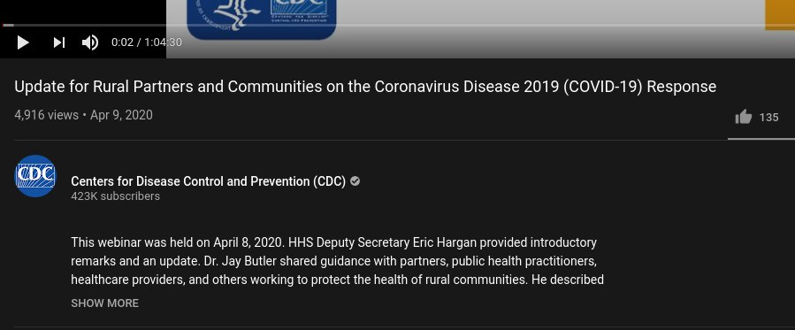

# Remove Youtube Fact Boxes
Userscript for Greasemonkey/Tampermonkey type extension to get rid of those annoying 'fact clarification' boxes on Youtube.

These things:

What is the point of putting a "listen to the CDC" on a video from the CDC official account? This is beyond too dumb to go along with, so this script gets rid of those:

You'll need either [Greasemonkey](https://www.greasespot.net) or [Tampermonkey](https://www.tampermonkey.net) then click [here to install](https://github.com/amckee/RemoveYoutubeFactBoxes/raw/main/remove_fact_boxes.user.js)

